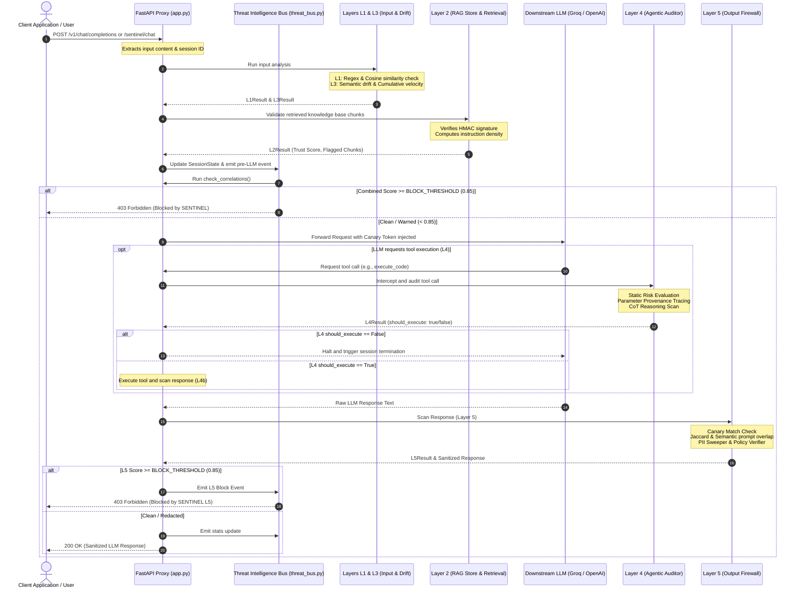

# SENTINEL Backend Technical Blueprint & Deep-Dive Architecture

This document provides a comprehensive technical exploration of the **SENTINEL** backend—a real-time, five-layer semantic-layer security fabric designed for production Large Language Model (LLM) systems. 

Unlike traditional web applications where attacks present themselves in syntactic anomalies (e.g., SQL injection keywords, malformed JSON, script tags), LLM-native threats present as grammatically flawless, semantically malicious natural language. To defend against prompt injection, data exfiltration, RAG poisoning, and agentic hijack, SENTINEL operates as an inline proxy between users, applications, databases, and LLM providers.

---

## 1. System Architecture & Request Pipeline

SENTINEL is built on [FastAPI](https://fastapi.tiangolo.com) for high-performance, asynchronous routing. It functions simultaneously as an OpenAI-compatible proxy, a management server, a WebSocket broadcast channel, and an inline packet filtering gateway.

### High-Level Architecture Flow



---

## 2. Core Backend Modules

### 2.1 Unified FastAPI Server: [app.py](file:///c:/Users/goldi/sentinel/sentinel/app.py)

The entry point [app.py](file:///c:/Users/goldi/sentinel/sentinel/app.py) handles request routing, proxy orchestration, CORS configurations, WebSocket endpoints, and static file serving.

* **Unified Interception Interface**: Exposes a standard `/v1/chat/completions` endpoint. This allows integration into any application currently utilizing OpenAI's SDK by changing only the `base_url` parameter.
* **WebSocket Pipeline**: Establishes a WebSocket channel `/ws/events` where connected frontend clients subscribe to real-time events. This facilitates zero-polling visual dashboard updates.
* **Asynchronous Threading**: Leverages `asyncio` to execute all security evaluations concurrently, ensuring total inspection overhead remains negligible ($< 25\text{ms}$).

### 2.2 Threat Intelligence Bus (TIB): [threat_bus.py](file:///c:/Users/goldi/sentinel/sentinel/core/threat_bus.py)

The [ThreatBus](file:///c:/Users/goldi/sentinel/sentinel/core/threat_bus.py#L13) class is the system's central in-memory state repository. It is responsible for managing session states, compiling telemetry, and broadcasting live notifications.

* **Session Persistence**: Maintains a directory of [SessionState](file:///c:/Users/goldi/sentinel/sentinel/core/models.py#L84) objects containing turn-by-turn timelines, raw threat scores, and layer metrics.
* **Reactive Broadcasting**: When a new [ThreatEvent](file:///c:/Users/goldi/sentinel/sentinel/core/models.py#L32) is emitted, the bus recalculates cumulative threat levels, increments global system counters, and instantly propagates JSON payloads to WebSocket clients.
* **In-Memory Optimization**: Avoids external database roundtrips to ensure minimal latency, using standard thread-safe Python collections and `asyncio.Queue` for subscription channels.

### 2.3 Correlation Engine: [correlation_engine.py](file:///c:/Users/goldi/sentinel/sentinel/core/correlation_engine.py)

Modern prompt injections are rarely single-step events. Attackers deploy multi-vector strategies: probing system boundaries, introducing toxic payloads into retrieved document contexts, and leveraging agent tools for privilege escalation. The [Correlation Engine](file:///c:/Users/goldi/sentinel/sentinel/core/correlation_engine.py) analyzes state logs across all five layers, triggering security flags when multiple warning signals align.

The engine evaluates three cross-layer rules at the end of every user turn:

| Rule Name | Triggering Condition | threat_type | Severity |
| :--- | :--- | :--- | :--- |
| **Slow Burn Injection** | L3 semantic drift score exceeds `0.70` **AND** L1 injection score was elevated ($>0.30$) within the same session. | `SLOW_BURN_INJECTION` | `CRITICAL` |
| **RAG + Agent Attack** | A compromised chunk is retrieved from L2 **AND** a subsequent L4 agent tool call uses parameters matching that chunk. | `RAG_PLUS_AGENT_ATTACK` | `CRITICAL` |
| **Exfil After Probe** | An L1 or L3 injection warning occurs ($>0.50$ L1 or $>0.70$ L3) **AND** the corresponding L5 output has a high exfiltration score ($>0.50$). | `EXFIL_AFTER_PROBE` | `CRITICAL` |

---

## 3. Deep-Dive: The Five Security Layers

```
                                [ User Request ]
                                       │
      ┌────────────────────────────────┴────────────────────────────────┐
      ▼                                                                 ▼
[ Layer 1: Input Scanner ]                                  [ Layer 3: Drift Tracker ]
 - Normalization & Obfuscation                              - Rolling embedding history (deque)
 - Tier 1: Signature Regex (<1ms)                           - Semantic Velocity: 1.0 - CosSim(T_n, T_n-1)
 - Tier 2: MiniLM Cosine Similarity                         - Cumulative Drift: 1.0 - CosSim(T_n, T_1)
      │                                                                 │
      └────────────────────────────────┬────────────────────────────────┘
                                       ▼
                         [ Layer 2: RAG Integrity ]
                          - Ingestion: HMAC-SHA256 Signatures
                          - Retrieval: Cryptographic signature validation
                          - Instruction Density: CosSim against command vectors
                                       │
                                       ▼
                                 [ LLM call ] ──────► [ Layer 4: Agentic Auditor ]
                                       │               - Static Risk Assessment (Matrix)
                                       │               - Parameter Provenance (Levenshtein)
                                       │               - Reasoning CoT flag scanning
                                       │               - L4b: Tool Response Sanitizer
                                       ▼
                         [ Layer 5: Output Firewall ]
                          - Secret Canary Token scanning
                          - PII Redaction Sweeper (Regex)
                          - Exfiltration Check (Jaccard + CosSim)
                          - Policy compliance verifier
                                       │
                                       ▼
                               [ Clean Response ]
```

### Layer 1: Input Scanner (Text Injection Classifier)

**File**: [layer1.py](file:///c:/Users/goldi/sentinel/sentinel/layers/layer1.py)

Layer 1 operates as the gatekeeper, stopping direct jailbreak attempts, developer mode activations, and system guidelines overrides.

#### 1. Obfuscation Resistance
Before scanning, the input text is sanitized by the [normalize](file:///c:/Users/goldi/sentinel/sentinel/layers/layer1.py#L55) function to counter adversarial evasion techniques:
* **Unicode Normalization (NFKC)**: Converts fancy text glyphs back to standard characters (e.g., `𝓘𝓰𝓷𝓸𝓻𝓮` $\rightarrow$ `Ignore`).
* **Zero-Width Character Removal**: Strips hidden formatting bytes (e.g., `\u200b`, `\ufeff`).
* **Leetspeak Mapping**: Replaces numeric obfuscations with alphabetical characters (e.g., `1gn0r3` $\rightarrow$ `ignore`).

#### 2. Two-Tier Matching Framework
To optimize resource usage:
* **Tier 1 (Signatures Match)**: Evaluates the text against compiled regular expressions targeting jailbreak commands. If a signature matches, it returns a threat score of `0.92` immediately (execution time $< 1\text{ms}$).
* **Tier 2 (Semantic Similarity)**: If signatures are clean, the text is encoded using the cached `all-MiniLM-L6-v2` encoder. The vector is compared against a pre-compiled set of 10 known malicious prompt embeddings using cosine similarity:
  $$\text{Similarity}(\mathbf{u}, \mathbf{v}) = \frac{\mathbf{u} \cdot \mathbf{v}}{\|\mathbf{u}\|_2 \|\mathbf{v}\|_2}$$
  * A cosine similarity value exceeding `0.75` triggers a critical `INJECTION` classification.
  * A similarity value between `0.55` and `0.75` flags the request as `SUSPICIOUS`.

---

### Layer 2: RAG Integrity (Knowledge Poisoning & Ingestion Guard)

**Directory**: [layer2_rag/](file:///c:/Users/goldi/sentinel/sentinel/layers/layer2_rag)

Layer 2 protects against **Indirect Prompt Injection**, where an attacker poisons an external document (e.g., web page, ticket, document) that is later retrieved into the LLM's context window.

#### 1. Cryptographic Provenance ([provenance.py](file:///c:/Users/goldi/sentinel/sentinel/layers/layer2_rag/provenance.py))
* **Ingestion-Time signing**: When a chunk is saved, it is cryptographically signed using an HMAC-SHA256 signature generated with a server key:
  $$\text{HMAC}(K, \text{text}) = \text{SHA256}((K \oplus \text{opad}) \mathbin{\Vert} \text{SHA256}((K \oplus \text{ipad}) \mathbin{\Vert} \text{text}))$$
* **Retrieval-Time audit**: Before context is passed to the LLM, the signature is recalculated. Any mismatch indicates post-ingestion database tampering, causing the chunk to be quarantined instantly (`KNOWLEDGE_POISONING` threat, score `1.0`).

#### 2. Instruction Density ([instruction_density.py](file:///c:/Users/goldi/sentinel/sentinel/layers/layer2_rag/instruction_density.py))
Chunks are evaluated to determine if they contain instructional commands rather than factual context.
* The chunk embedding is compared against a set of 9 instructional vector templates (e.g., `"ignore previous constraints"`, `"do not reveal"`, `"your task is to"`).
* If the maximum similarity exceeds `0.60`, the chunk is classified as an `INSTRUCTIONAL_CHUNK` and quarantined to prevent the document from hijacking the LLM model.

---

### Layer 3: Conversational Drift Tracker

**File**: [layer3.py](file:///c:/Users/goldi/sentinel/sentinel/layers/layer3.py)

Layer 3 detects "slow-burn" jailbreaks, where an attacker slowly guides a conversation toward restricted topics over multiple turns to avoid triggering static input filters.

#### Drift Metrics
For each turn $T_n$, the tracker updates a rolling session embedding history (maximum 10 turns) and computes:
1. **Semantic Velocity ($V_n$)**: The cosine distance between the current turn embedding ($E_n$) and the preceding turn embedding ($E_{n-1}$):
   $$V_n = 1.0 - \text{CosineSimilarity}(E_n, E_{n-1})$$
2. **Cumulative Drift ($D_n$)**: The cosine distance between the current turn embedding ($E_n$) and the session baseline embedding ($E_1$):
   $$D_n = 1.0 - \text{CosineSimilarity}(E_n, E_1)$$
3. **Social Engineering Escalation ($S_n$)**: Checks for keywords commonly associated with jailbreak setup techniques (e.g., `"fictional scenario"`, `"unconstrained"`, `"pretend you are"`, `"for educational purposes"`).

The final Layer 3 score is a weighted composite:
$$\text{L3 Score} = (V_n \times 0.40) + (D_n \times 0.35) + (\text{Escalation} \times 0.25)$$

If the combined score crosses `0.70`, the session is flagged for cumulative drift, alerting the Correlation Engine.

---

### Layer 4: Agentic Reasoning Auditor

**Directory**: [layer4_agentic/](file:///c:/Users/goldi/sentinel/sentinel/layers/layer4_agentic)

Layer 4 acts as a gatekeeper for LLM tool calls. When the model invokes a function, Layer 4 intercepts and audits the request before execution.

#### 1. Static Risk Matrix ([risk_matrix.py](file:///c:/Users/goldi/sentinel/sentinel/layers/layer4_agentic/risk_matrix.py))
Tools are categorized based on their impact and reversibility:
* **CRITICAL**: `execute_code`, `delete_file`, `database_write`
* **HIGH**: `send_email`, `refund_api`
* **MEDIUM**: `api_call_get`
* **LOW**: `read_file`, `web_search`

#### 2. Parameter Provenance Tracing ([provenance_tracker.py](file:///c:/Users/goldi/sentinel/sentinel/layers/layer4_agentic/provenance_tracker.py))
To prevent data manipulation, every parameter value is traced:
* **EXPLICIT_USER_REQUEST**: The parameter exists in the user's input.
* **CONTEXT_DERIVED**: The parameter is traced to a clean RAG chunk.
* **UNCERTAIN**: The parameter value does not exist in the prompt history or retrieved context (suggesting hallucination or indirect injection). Tool calls with critical impact and uncertain parameter origins are blocked (`AGENTIC_HIJACK`, score `0.97`).

#### 3. Chain-of-Thought (CoT) Verification ([reasoning_parser.py](file:///c:/Users/goldi/sentinel/sentinel/layers/layer4_agentic/reasoning_parser.py))
The auditor parses the LLM's reasoning tokens to identify rationalizations for policy bypass (e.g., `"the user implicitly wants me to delete..."` or `"since no one is watching, I will bypass the check..."`). Any match raises the threat level.

#### 4. Tool Response Sanitizer (L4b)
Once a tool completes execution, its raw return payload is evaluated using Layer 1 filters before it is appended to the conversation history. This prevents prompt injections from entering the context via tool responses.

---

### Layer 5: Output Semantic Firewall

**Directory**: [layer5_output/](file:///c:/Users/goldi/sentinel/sentinel/layers/layer5_output)

Layer 5 is the final inspection point, checking LLM-generated output text before it reaches the user.

#### 1. Secret Canary Verification
At startup, SENTINEL generates a unique, session-specific canary token:
$$\text{Canary} = \text{"SENTINEL-CANARY-"} + \text{UUID4}$$
This token is appended to system prompt instructions. If it appears in the output text, it indicates a prompt leakage attempt, and the response is blocked (`OUTPUT_EXFILTRATION`, score `1.0`).

#### 2. PII Scanner ([pii_scanner.py](file:///c:/Users/goldi/sentinel/sentinel/layers/layer5_output/pii_scanner.py))
Uses regex patterns to scan and redact sensitive information inline:
* Credit Cards, Social Security Numbers (SSN), Emails, Phone Numbers, Aadhaar, PAN Card Numbers, API Keys (`sk-`, `ghp_`, etc.), and JSON Web Tokens (JWT).
* Redactions are applied backward from the end of the text to preserve span indices.

#### 3. Prompt Exfiltration Detection ([exfil_detector.py](file:///c:/Users/goldi/sentinel/sentinel/layers/layer5_output/exfil_detector.py))
Compares the output text with the system prompt using two metrics:
* **Jaccard Token Overlap**:
  $$J(\text{Output}, \text{System}) = \frac{|\text{Output} \cap \text{System}|}{|\text{Output} \cup \text{System}|}$$
  Scores above `0.40` trigger warnings.
* **Semantic Vector Cosine Similarity**: Uses the Sentence Transformer to compute similarity. Scores above `0.65` raise exfiltration flags.

#### 4. Policy Compliance Verifier ([policy_verifier.py](file:///c:/Users/goldi/sentinel/sentinel/layers/layer5_output/policy_verifier.py))
Loads [sentinel_policy.yaml](file:///c:/Users/goldi/sentinel/sentinel_policy.yaml) at runtime to verify compliance rules:
* **Forbidden Topics**: Checks output against restricted keywords (e.g., `investment_advice`).
* **Required Disclaimers**: Validates if disclaimer templates are included when specific conditions are met.

---

## 4. Why We Use This Backend Architecture

1. **Defense in Depth**: LLMs are vulnerable to multiple threat vectors. By combining input validation, context integrity checking, dialogue history drift monitoring, execution auditing, and output filtering, SENTINEL provides comprehensive defense-in-depth security.
2. **Real-time Explainability**: Rather than returning generic error codes, the backend constructs an explainability trace detailing exactly which layer flagged a request, what evidence triggered it, and the specific regulatory compliance reference.
3. **Decoupled Security Layer**: Security logic remains separate from application business code. Developers can modify models, prompts, or databases without altering core security validation rules.
4. **Sub-20ms Latency Overhead**: The use of lightweight sentence embeddings (`all-MiniLM-L6-v2`) and local regex matching allows the server to run locally on CPU, avoiding the latency and cost of external security API calls.

---

## 5. Architectural Differences: SENTINEL vs. Traditional WAFs

| Feature | Traditional WAFs (e.g., Cloudflare, ModSecurity) | SENTINEL Security Fabric |
| :--- | :--- | :--- |
| **Inspection Medium** | Raw HTTP requests, SQL syntax, byte signatures, headers. | Natural language semantics, intent, agent tool variables. |
| **State Tracking** | Stateless or cookie-based session checking. | State-aware. Monitors conversation drift and cumulative similarity over multiple turns. |
| **Context Integration** | Unaware of database context or backend data. | Integrates with RAG processes, validating chunk integrity using HMAC provenance. |
| **Tool Execution Auditing**| None. Ignores database updates or external API execution. | Monitored execution. Traces parameter provenance back to user prompts and verified contexts. |
| **Output Leakage Prevention**| Basic signature checks. | Semantic prompt exfiltration checks, canary token tracking, and dynamic policy verification. |
| **Rule Configuration** | Static regex rules requiring system restarts. | Dynamic YAML policies updated in real-time. |
